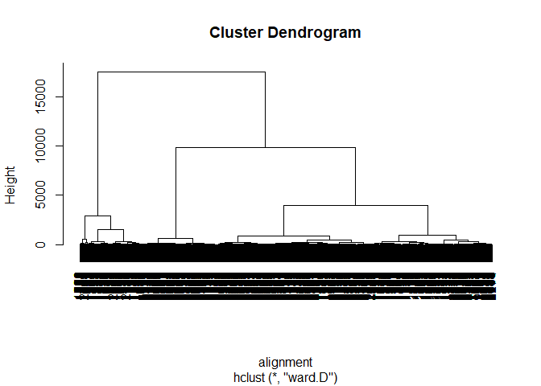
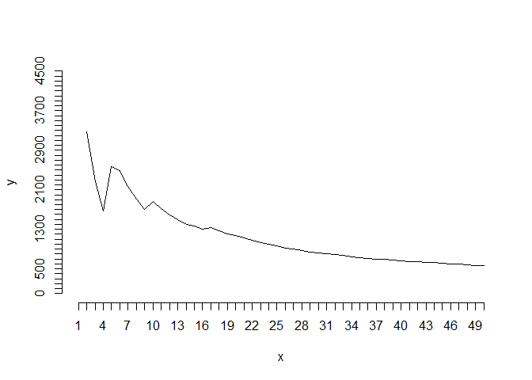
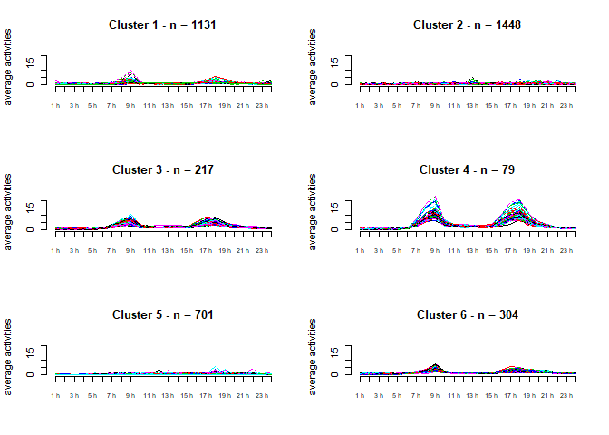
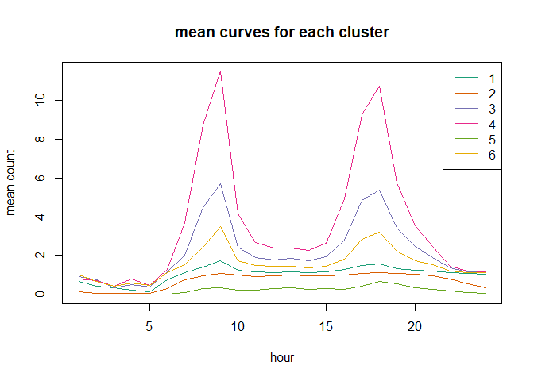
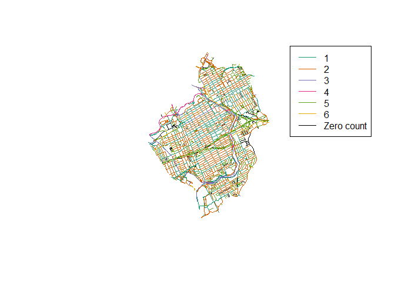
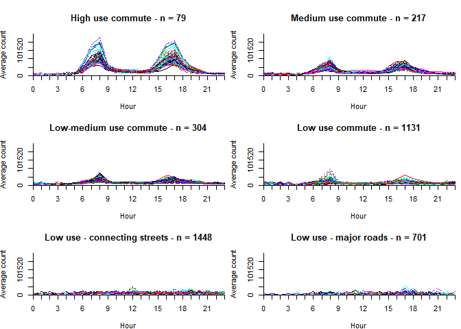
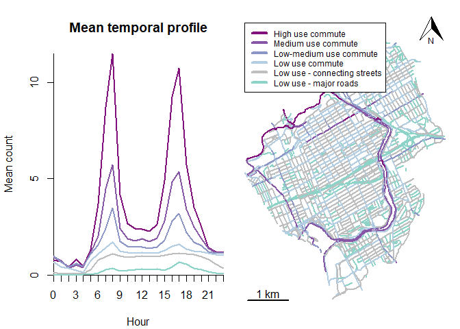

Strava Ottawa Temporal Patterns
================
Colin Ferster and Vanessa Brum-Bastos
September 23, 2019

The purpose of this document is to explore temporal patterns in Ottawa
Strava Metro data.

``` r
setwd("D:/strava_temporalPatterns/ottawa")


library(rgdal)
library(raster)
library(timeDate)
library(RColorBrewer)
library(dplyr)
library(magrittr)
library(chron)
library(ggplot2)
library(dtw)
library(tidyr)
library(parallelDist)
library(fpc)
library(pracma)
library(prettymapr)
```

## 1\. Preprocess Strava Metro data

Get hourly means for weekdays in non-winter months

``` r
# edges clipped to the study area
edges <- readOGR(".","studyArea_edges")
```

    ## OGR data source with driver: ESRI Shapefile 
    ## Source: "D:\strava_temporalPatterns\ottawa", layer: "studyArea_edges"
    ## with 4041 features
    ## It has 34 fields
    ## Integer64 fields read as strings:  GID RCSTATUT RCTYPTRON RCPROPRIO RCSENSUNIQ RCHIERARCH RCVITESS RRTYPSENT RRPROPRIO RRSTATUT RRROUTVERT

``` r
edges_utm <- spTransform(edges, CRS("+init=epsg:32618")) # UTM 11N

# 1 minute core street level Strava Metro ride data for edges in the study area
data <- read.csv("edges_ride_2016_studyArea.csv")

# format dates, get weekdays and season
data$date <- strptime(paste0(data$day,
                             " ",
                             data$year, " ",
                             data$hour, " ",
                             data$minute),
                             "%j %Y %H %M")

data$date_day <- format(data$date,"%Y-%m-%d")

# business days from Toronto Stock Exchange (TSX) calendar
data$weekday <- isBizday(as.timeDate(data$date_day),
                         holidayTSX(as.integer(unique(data$year))))

# season
# winter months with minimum daily temp less than zero degrees Celsius
# source: http://climate.weather.gc.ca/climate_normals/results_1981_2010_e.html
# Ottawa CDA (weather station nearest the study area)

winter <- c("11","12","01","02","03") 
data$month <- format.Date(data$date, format="%m")
data$winter <- data$month %in% winter

# weekdays not in winter

data.summer.weekday <- data[which(data$weekday == T & data$winter == F),]

# sum by hour for each day
data.summer.weekday.hourly <- aggregate(total_activity_count
                        ~edge_id+hour+date_day,data=data.summer.weekday,FUN="sum")

# get hourly mean 
data.summer.weekday.hourly.means <- aggregate(total_activity_count ~ edge_id + hour,
                                            FUN = "mean",
                                            data=data.summer.weekday.hourly)

names(data.summer.weekday.hourly.means) <- c("edge_id","hour","mean_activity_count")
```

## 2\. Descriptive plots

``` r
# create a matrix with counts for each edge at each hour
unique_edges = unique(data.summer.weekday.hourly.means$edge_id)

# 24 hours, counting from zero
unique_hours = seq(0,23,1)

matrix<-data.frame(unique_edges)

for (i in 1:length(unique_hours)) {
  matrix[, i+1] <- NA
}

names(matrix) <- c("edge_id",paste0(unique_hours))

# populate the matrix with counts
for (h in unique_hours){
  
  subs<- subset(data.summer.weekday.hourly.means, hour==h)
  un_edges = unique(subs$edge_id)
  
  for (id in un_edges){
    sub2<-subset(subs, edge_id==id)
    row1<-which(matrix$edge_id==id)
    # index + 2: 
    # +1 to skip edge_id 
    # +1 because we count hours from zero, yet the index starts at 1
    matrix[row1,h+2]<-sub2$mean_activity_count 
    
  }
  
}

#NA's are zeros
matrix[is.na(matrix)] <- 0

# plot 24 hrs
hourRange <- 1:24 # names of the hours
hourIndex <- 2:25 # index of the hours in the matrix

# get the range of observations (highest hourly mean)
maxRange <- c(0,max(c(max(matrix[,hourIndex])))+2) # + 2 is for a bit of room at the top of the plot

matrix.hours<-data.matrix(matrix[1:nrow(matrix),hourIndex]) 

threeHourTicks <- c(1,4,7,10,13,16,19,22)
threeHourLabels <- c("0","3","6","9","12","15","18","21")

par(mar=c(3.9, 3.8, 0.5, 0.7))
{  
    matplot(t(matrix.hours), type="l", 
        ylim=c(0,maxRange[2]),
        ylab='Average count', 
        xlab='Hour', 
        axes=F, xaxs="i",yaxs="i", cex = 0.7)
  axis(1, at = 1:length(hourRange), labels = NA, cex = 0.7)
  axis(1, at = threeHourTicks, labels = threeHourLabels, cex = 0.7)

  axis(2, at =seq(0,maxRange[2],5), labels =seq(0,maxRange[2],5), cex = 0.7)
  axis(2, at =0, labels =0, cex = 0.7)
  axis(2, at =c(0,15,25), labels =c(0,15,25), cex = 0.7)
}
```

<!-- -->

## 3\. Calculate dynamic time warped (DTW) distance matrix and cluster into groups

``` r
# calculate statistical distance between edges using dynamic time warping (DTW), with a +-1 hour window
alignment<-parDist(matrix.hours, method = "dtw", window.size=1, window.type ='sakoechiba')

# heirarchical clustering using Ward's d and produce a tree plot
hclust_avg<-hclust(alignment, method = 'ward.D')
plot(hclust_avg)
```

<!-- -->

``` r
cl<-seq(from=1,to=50, by=1)
x<-character(0)
y<-character(0)

for (n in cl){
  cl1.4 <- cutree(hclust_avg, k= n)
  ind<-calinhara(matrix.hours,cl1.4,cn=max(cl1.4))
  x<-c(x,n)
  y<-c(y,ind)
}

# plot of Calinski-Harabasz index for different levels of pruning
{
plot(x,y,type='l', axes=FALSE, xlim=c(1,50), ylim=c(0,4500))
axis(side = 1, at = seq(50,1))
axis(side =2, at = seq(0,4500,100))
}
```

<!-- -->

``` r
# inflection point at 6, so we pick 6 clusters
groups <- cutree(hclust_avg, k=6)
```

## 4\. Plot the clusters

``` r
seeds_df_cl <- matrix
seeds_df_cl$cluster <- groups
count(seeds_df_cl,cluster)
```

    ## # A tibble: 6 x 2
    ##   cluster     n
    ##     <int> <int>
    ## 1       1  1131
    ## 2       2  1448
    ## 3       3   217
    ## 4       4    79
    ## 5       5   701
    ## 6       6   304

``` r
clusters <- unique(seeds_df_cl$cluster)

#plot the time series for each cluster
{
par(mfrow = c(3,2))

for (n in clusters){
  
  c<-seeds_df_cl[which(seeds_df_cl$cluster==n),]
  {
  title= paste('Cluster',as.character(n),'- n =', as.character(nrow(c)) )
  matplot(t(c[,-which(names(c) %in% c("edge_id","peaks","cluster"))]), 
          type="l",ylab="average activities", axes=F, ylim = c(0,maxRange[2]),
          main = title)
  axis(1, at = 1:length(hourRange), labels = paste(min(hourRange):max(hourRange), 'h'), cex.axis=0.7)
  axis(2, at =seq(0,maxRange[2],5), labels =seq(0,maxRange[2],5))
  }
}
}
```

<!-- -->

``` r
# plot means on the same graph
seeds_df_cl_means <- seeds_df_cl
# add an "X" to variable names to make it easier to use formulas
names(seeds_df_cl_means) <- paste0("X",names(seeds_df_cl_means))

meanCurves <- aggregate(cbind(X0,X1,X2,X3,X4,X5,X6,X7,X8,X9,X10,X11,X12,X13,X14,X15,X16,X17,
                              X18,X19,X20,X21,X22,X23)~Xcluster, 
                        data = seeds_df_cl_means,
                        FUN = "mean")

cols <- brewer.pal(6,"Dark2")
par(mfrow = c(1,1))

{
plot(x=as.character(hourRange),
     y=meanCurves[1,2:ncol(meanCurves)], 
     ylim = c(0,max(meanCurves)),pch = NA,
     xlab = "hour", ylab = "mean count", main = "mean curves for each cluster")
for(i in 1:6){
  lines(x=as.character(hourRange),y=meanCurves[i,2:ncol(meanCurves)], col=cols[i])
}
legend("topright",col = cols, lty= 1, legend = paste0(1:6))

}
```

<!-- -->

``` r
edges_classes <- merge(edges_utm, seeds_df_cl, by.x = "GID", by.y ="edge_id", all.x =T)

# make sure the order in the legend is correct
edges_classes$class <- as.factor(edges_classes$cluster)

class_labels <- levels(edges_classes$class)
mapColors <- cols[as.integer(edges_classes$class)]

# add in black for zero count edges
mapColors[is.na(mapColors)] <- "#000000"
legendLabels <- levels(edges_classes$class)
legendLabels <- c(legendLabels, "Zero count")
cols <- c(cols, "#000000")

{plot(edges_classes, col = mapColors)
legend("topright", lty = 1,
       col = cols,
       legend = legendLabels)
}
```

<!-- -->

``` r
# There are n = 161 edges with zero counts. 
# They are mostly private service roads, highway ramps, or poorly 
# connected residential streets that are not high priorities for 
# bike count programs.
```

## 5\. Interpret and name the clusters

``` r
seeds_df_cl$class<-ifelse(seeds_df_cl$cluster==1,'Low use commute',
                          ifelse(seeds_df_cl$cluster==2,'Low use - connecting streets',
                          ifelse(seeds_df_cl$cluster==3,'Medium use commute',       
                          ifelse(seeds_df_cl$cluster==4,'High use commute',    
                          ifelse(seeds_df_cl$cluster==5,'Low use - major roads',
                          ifelse(seeds_df_cl$cluster==6,'Low-medium use commute',
                          "NA"))))))

seeds_df_cl$class<- as.factor(seeds_df_cl$class)

# order the clusters by counts
levels(seeds_df_cl$class)
```

    ## [1] "High use commute"             "Low-medium use commute"      
    ## [3] "Low use - connecting streets" "Low use - major roads"       
    ## [5] "Low use commute"              "Medium use commute"

``` r
seeds_df_cl$class = factor(seeds_df_cl$class,levels(seeds_df_cl$class)[c(1,6,2,5,3,4)])

# names of the classes
classes<-unique(seeds_df_cl$class)

# match order by counts
classes <- classes[c(4,3,6,1,2,5)]

{
par(mfrow = c(3,2))

  for (n in classes){
  
  c<-seeds_df_cl[which(seeds_df_cl$class==n),]
  {
  par(mar=c(3.9, 3.8, 3.9, 0.7))
  title= paste(as.character(n),'- n =', as.character(nrow(c)) )
  {  
matplot(t(c[,-which(names(c) %in% c("edge_id","cluster","class"))]), type="l", 
        ylim=c(0,maxRange[2]),
        ylab='Average count', 
        xlab='Hour', 
        main = title,
        axes=F, xaxs="i",yaxs="i", cex = 0.7)
  axis(1, at = 1:length(hourRange), labels = NA, cex = 0.7)
  axis(1, at = threeHourTicks, labels = threeHourLabels, cex = 0.7)

  axis(2, at =seq(0,maxRange[2],5), labels =seq(0,maxRange[2],5), cex = 0.7)
  axis(2, at =c(15,25), labels =c(15,25), cex = 0.7)
  
  }
  
  }
  }
}
```

<!-- -->

``` r
# plot means on the same graph
seeds_df_cl_means <- seeds_df_cl
# add an x to variable names because some start with numbers - hard to work with in formula
names(seeds_df_cl_means) <- paste0("X",names(seeds_df_cl_means))
meanCurves <- aggregate(cbind(X0,X1,X2,X3,X4,X5,X6,X7,X8,X9,X10,X11,X12,X13,X14,X15,X16,X17,
                              X18,X19,X20,X21,X22,X23)~Xclass, 
                        data = seeds_df_cl_means,
                        FUN = "mean")
classes <- levels(as.factor(seeds_df_cl_means$Xclass))
nclass <- length(classes)

colsCommute <- brewer.pal(5,"BuPu")

# add colours for low use classes
cols <- c(rev(colsCommute)[-5],"grey","#8dd3c7")

par(mfrow = c(1,2))

{
par(mar=c(4.1, 4.1, 4.1, 0.5))

plot(x=as.character(hourRange),
     y=meanCurves[1,2:ncol(meanCurves)], ylim = c(0,max(meanCurves[,c(2:ncol(meanCurves))])),
     pch = NA,
     xlab = "Hour", ylab = "Mean count", main = "Mean temporal profile", 
     axes = F,xaxs="i",yaxs="i")
  axis(1, at = 1:length(hourRange), labels = NA, cex = 0.7)
  axis(1, at = threeHourTicks, labels = threeHourLabels, cex = 0.7)

  axis(2, at =seq(0,maxRange[2],5), labels =seq(0,maxRange[2],5), cex = 0.7)
  axis(2, at =c(15,25), labels =c(15,25), cex = 0.7)
  
for(i in 1:nclass){
  lines(x=as.character(hourRange),y=meanCurves[i,2:ncol(meanCurves)], col=cols[i], lwd = 2)
} 

}

# map
edges_classes <- merge(edges_utm, seeds_df_cl, by.x = "GID", by.y ="edge_id", all.x =T)

# make sure the order in the legend is correct
edges_classes$class <- as.factor(edges_classes$class)

class_labels <- levels(edges_classes$class)
mapColors <- cols[as.integer(edges_classes$class)]

par(mar=c(1, 0.5, 0.5, 0.5))
  
{plot(edges_classes, col = mapColors, lwd = 2)
legend(x = edges_classes@bbox[1,1],
       y = edges_classes@bbox[2,2],
       lty = 1,
       col = cols,
       legend = levels(edges_classes$class),
       lwd = 4,
       cex = 0.75)
scalebar(1000, label = "1 km")
addnortharrow(scale = 0.6)
}
```

<!-- -->
