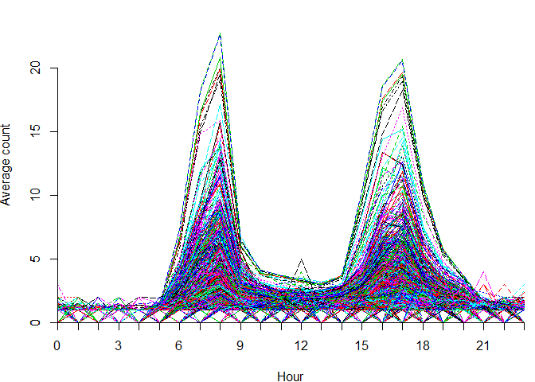
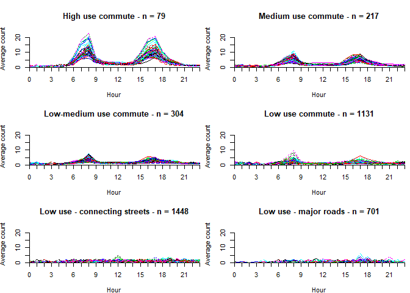

Strava Ottawa Temporal Patterns
================
Colin Ferster and Vanessa Brum-Bastos
September 23, 2019

The purpose of this document is to explore temporal patterns in Ottawa
Strava Metro data.

``` r
# load packages
library(rgdal)
library(raster)
library(timeDate)
library(RColorBrewer)
library(dplyr)
library(magrittr)
library(chron)
library(ggplot2)
library(dtw)
library(tidyr)
library(parallelDist)
library(fpc)
library(pracma)
library(prettymapr)
```

## 1\. Preprocess Strava Metro data

Get hourly means for weekdays in non-winter months

``` r
# 1 minute core street level Strava Metro ride data for edges in the study area
data <- read.csv("edges_ride_2016_studyArea.csv")

# Strava edges (street segments) clipped to the study area (spatial data)
edges <- readOGR(".", "studyArea_edges")
```

    ## OGR data source with driver: ESRI Shapefile 
    ## Source: "D:\strava_temporalPatterns\ottawa", layer: "studyArea_edges"
    ## with 4041 features
    ## It has 34 fields
    ## Integer64 fields read as strings:  GID RCSTATUT RCTYPTRON RCPROPRIO RCSENSUNIQ RCHIERARCH RCVITESS RRTYPSENT RRPROPRIO RRSTATUT RRROUTVERT

``` r
edges_utm <- spTransform(edges, CRS("+init=epsg:32618")) # project to UTM 11N NAD83 for Ottawa

# format Strava dates, get weekdays and season
data$date <- strptime(paste0(data$day,
                             " ",
                             data$year, " ",
                             data$hour, " ",
                             data$minute),
                             "%j %Y %H %M")

data$date_day <- format(data$date, "%Y-%m-%d")

# business days from Toronto Stock Exchange (TSX) calendar
data$weekday <- isBizday(as.timeDate(data$date_day),
                         holidayTSX(as.integer(unique(data$year))))

# season
# winter months with minimum daily temp less than zero degrees Celsius
# source: http://climate.weather.gc.ca/climate_normals/results_1981_2010_e.html
# Ottawa CDA (weather station nearest the study area)
winter <- c("11", "12", "01", "02", "03") 
data$month <- format.Date(data$date, format="%m")
data$winter <- data$month %in% winter

# select weekdays not in winter
data.summer.weekday <- data[which(data$weekday == T & data$winter == F),]

# sum Strava activity counts by hour for each day
data.summer.weekday.hourly <- aggregate(total_activity_count
                        ~edge_id + hour + date_day,
                        data=data.summer.weekday, 
                        FUN="sum")

# get hourly mean of Strava activity counts 
data.summer.weekday.hourly.means <- aggregate(total_activity_count ~ edge_id + hour,
                                            FUN = "mean",
                                            data=data.summer.weekday.hourly)

# change column names to indicate that it is the calculated mean of Strava activity counts
names(data.summer.weekday.hourly.means) <- c("edge_id", "hour", "mean_activity_count")
```

## 2\. Descriptive plots

``` r
# create a matrix with Strava counts for each edge at each hour
unique_edges = unique(data.summer.weekday.hourly.means$edge_id)

# sequence of 24 hours, counting from zero
unique_hours = seq(0, 23, 1)

matrix <- data.frame(unique_edges)

for (i in 1:length(unique_hours)) {
  matrix[, i+1] <- NA
}

names(matrix) <- c("edge_id", paste0(unique_hours))

# populate the matrix with Strava counts
for (h in unique_hours){
  
  subs <- subset(data.summer.weekday.hourly.means, hour==h)
  un_edges = unique(subs$edge_id)
  
  for (id in un_edges){
    sub2 <- subset(subs, edge_id == id)
    row1 <- which(matrix$edge_id == id)
    # index + 2: 
    # +1 to skip edge_id 
    # +1 because we count hours from zero, yet the index starts at 1
    matrix[row1,h+2] <- sub2$mean_activity_count 
    
  }
  
}

# Assign 0 to NA (NA indicates a zero count)
matrix[is.na(matrix)] <- 0

# plot 24 hrs of aggregated Strava data
hourRange <- 1:24 # names of the hours
hourIndex <- 2:25 # index of the hours in the matrix

# get the range of Strava counts (find the highest hourly mean)
maxRange <- c(0, max(c(max(matrix[, hourIndex]))) +2) # + 2 is to increase the margin at the top of the plot

# matrix of average Strava counts by hour
matrix.hours <- data.matrix(matrix[1:nrow(matrix), hourIndex]) 

# labels for the tickmarks every 3 hours
threeHourTicks <- c(1, 4, 7, 10, 13, 16, 19, 22) # tickmark locations
threeHourLabels <- c("0", "3", "6", "9", "12", "15", "18", "21") # tickmark labels

# adjust margins
par(mar=c(3.9, 3.8, 0.5, 0.7))

{  
    matplot(t(matrix.hours), type="l", 
        ylim = c(0,maxRange[2]),
        ylab = 'Average count', 
        xlab = 'Hour', 
        axes = F, 
        xaxs = "i",  yaxs="i", 
        cex = 0.7)
  
  # x axis ticks and labels
  axis(1, at = 1:length(hourRange), 
       labels = NA, cex = 0.7) # ticks for each hour
  axis(1, at = threeHourTicks, 
       labels = threeHourLabels, cex = 0.7) # label every 3 hours
  
  # y axis ticks and labels
  axis(2, at = seq(0, maxRange[2], 5), 
       labels = seq(0, maxRange[2], 5), 
       cex = 0.7)
  axis(2, at = 0, labels = 0, 
       cex = 0.7) # make sure there is a tick at 0
}
```

<!-- -->

## 3\. Calculate dynamic time warped (DTW) distance matrix and cluster into groups

``` r
# calculate statistical distance between all edges using dynamic time warping (DTW), 
# Use a +-1 hour window using a sakoechiba band
alignment <- parDist(matrix.hours, 
                   method = "dtw", 
                   window.size = 1, 
                   window.type ='sakoechiba')

# heirarchical clustering using Ward's d
hclust_avg <- hclust(alignment, method = 'ward.D')

# produce a tree plot of the clusters
plot(hclust_avg)
```

<!-- -->

``` r
# calculate the Calinski-Harabasz index for clusters ranging from 1 to 50
cl <- seq(from = 1, to = 50, by = 1)
x <- character(0)
y <- character(0)

# caculate the Calinski-Harabasz index for each level of pruning
for (n in cl){
  cl1.4 <- cutree(hclust_avg, k= n)
  ind <- calinhara(matrix.hours, cl1.4, cn = max(cl1.4))
  x <- c(x, n)
  y <- c(y, ind)
}

# plot of Calinski-Harabasz index for levels of pruning
{
plot(x, y, type='l', axes = FALSE, xlim=c(1, 50), ylim = c(0, 4500))
axis(side = 1, at = seq(50, 1))
axis(side = 2, at = seq(0, 4500, 100))
}
```

<!-- -->

``` r
# inflection point at 6, so we pick 6 clusters
groups <- cutree(hclust_avg, k = 6)
```

## 4\. Plot the clusters

``` r
# assign the cluster numbers to the edges
seeds_df_cl <- matrix
seeds_df_cl$cluster <- groups
count(seeds_df_cl, cluster)
```

    ## # A tibble: 6 x 2
    ##   cluster     n
    ##     <int> <int>
    ## 1       1  1131
    ## 2       2  1448
    ## 3       3   217
    ## 4       4    79
    ## 5       5   701
    ## 6       6   304

``` r
# get the unique cluster names
clusters <- unique(seeds_df_cl$cluster)

#plot the time series for each cluster
{
  par(mfrow = c(3, 2))
  
  # loop through each cluster and plot all of the time series
  for (n in clusters){
    
    # get the time series in each cluster
    c <- seeds_df_cl[which(seeds_df_cl$cluster == n), ]
    
    {
    title= paste('Cluster', as.character(n), '- n =', as.character(nrow(c)))
    matplot(t(c[, -which(names(c) %in% c("edge_id", "peaks", "cluster"))]), 
            type="l", ylab="average activities", axes = F, ylim = c(0, maxRange[2]),
            main = title)
    # x axis ticks and labels
    axis(1, at = 1:length(hourRange), labels = paste(min(hourRange):max(hourRange), 'h'), cex.axis=0.7)
    
    # y axis ticks and labels
    axis(2, at =seq(0,maxRange[2], 5), labels =seq(0, maxRange[2],5))
    }
  }
}
```

<!-- -->

``` r
# plot means on the same graph
seeds_df_cl_means <- seeds_df_cl

# add an "X" to variable names to make it easier to use formulas
names(seeds_df_cl_means) <- paste0("X", names(seeds_df_cl_means))

# calculate the mean time series for each cluster
meanCurves <- aggregate(cbind(X0, X1, X2, X3, X4, X5, X6, X7, X8, X9, X10,
                              X11, X12, X13, X14, X15, X16, X17, X18, X19,
                              X20, X21, X22, X23) ~ Xcluster, 
                        data = seeds_df_cl_means,
                        FUN = "mean")

# 6 colour scheme
cols <- brewer.pal(6, "Dark2")
par(mfrow = c(1, 1))

{
plot(x = as.character(hourRange),
     y = meanCurves[1, 2:ncol(meanCurves)], 
     ylim = c(0, max(meanCurves)), pch = NA, # empty plot - add lines later
     xlab = "hour", ylab = "mean count", main = "mean curves for each cluster")
  
  # plot each mean curve
  for(i in 1:6){
  lines(x = as.character(hourRange),
        y = meanCurves[i, 2:ncol(meanCurves)], 
        col = cols[i])
  }

  # add legend  
  legend("topright",col = cols, lty= 1, legend = paste0(1:6))
}
```

<!-- -->

``` r
# map the clusters

# merge the spatial data
edges_classes <- merge(edges_utm, seeds_df_cl, by.x = "GID", by.y ="edge_id", all.x =T)

# make sure the order in the legend is correct
edges_classes$class <- as.factor(edges_classes$cluster)
class_labels <- levels(edges_classes$class)

# assign colours to each class
mapColors <- cols[as.integer(edges_classes$class)]

# add in black for zero count edges
mapColors[is.na(mapColors)] <- "#000000"
cols <- c(cols, "#000000")

# get labels for legend
legendLabels <- levels(edges_classes$class)
legendLabels <- c(legendLabels, "Zero count")

{
  plot(edges_classes, col = mapColors)
  legend("topright", lty = 1,
       col = cols,
       legend = legendLabels)
}
```

<!-- -->

``` r
# There are n = 161 edges with zero counts. 
# They are mostly private service roads, highway ramps, or poorly 
# connected residential streets that are not high priorities for 
# bike count programs.
```

## 5\. Interpret and name the clusters

``` r
# name the clusters
seeds_df_cl$class <- ifelse(seeds_df_cl$cluster==1,'Low use commute',
                          ifelse(seeds_df_cl$cluster==2,'Low use - connecting streets',
                          ifelse(seeds_df_cl$cluster==3,'Medium use commute',       
                          ifelse(seeds_df_cl$cluster==4,'High use commute',    
                          ifelse(seeds_df_cl$cluster==5,'Low use - major roads',
                          ifelse(seeds_df_cl$cluster==6,'Low-medium use commute',
                          "NA"))))))

# make class a factor variable
seeds_df_cl$class<- as.factor(seeds_df_cl$class)

# order the clusters by counts: highest to lowest
levels(seeds_df_cl$class)
```

    ## [1] "High use commute"             "Low-medium use commute"      
    ## [3] "Low use - connecting streets" "Low use - major roads"       
    ## [5] "Low use commute"              "Medium use commute"

``` r
seeds_df_cl$class = factor(seeds_df_cl$class, levels(seeds_df_cl$class)[c(1, 6, 2, 5, 3, 4)])

# names of the classes
classes<-unique(seeds_df_cl$class)

# match the above order (by counts: highest to lowest)
classes <- classes[c(4, 3, 6, 1, 2, 5)]

{
  # layout with two panels
  par(mfrow = c(3,2))
  
  # plot out the time series for all edges in each cluster
  for (n in classes){
    c<-seeds_df_cl[which(seeds_df_cl$class==n),]
    {
      # adjust margins
      par(mar=c(3.9, 3.8, 3.9, 0.7))
      title= paste(as.character(n),'- n =', as.character(nrow(c)))
        {  
            matplot(t(c[, -which(names(c) %in% c("edge_id", "cluster", "class"))]), type="l", 
                    ylim=c(0, maxRange[2]),
                    ylab='Average count', 
                    xlab='Hour', 
                    main = title,
                    axes=F, xaxs="i", yaxs="i", cex = 0.7)
              # x axis ticks
              axis(1, at = 1:length(hourRange), labels = NA, cex = 0.7)
              
              # x axis labels (every 3 hours)
              axis(1, at = threeHourTicks, labels = threeHourLabels, cex = 0.7)
              
              # y axis ticks and labels
              axis(2, at =seq(0,maxRange[2],5), labels =seq(0,maxRange[2],5), cex = 0.7)
        }
    }
  }
}
```

<!-- -->

``` r
# plot means on the same graph
seeds_df_cl_means <- seeds_df_cl

# add an x to variable names because some start with numbers - hard to work with in formula
names(seeds_df_cl_means) <- paste0("X", names(seeds_df_cl_means))

# calculate the mean time series for each cluster
meanCurves <- aggregate(cbind(X0, X1, X2, X3, X4, X5, X6, X7, X8, X9, X10,
                              X11, X12, X13, X14, X15, X16, X17, X18, X19,
                              X20, X21, X22, X23) ~ Xclass, 
                        data = seeds_df_cl_means,
                        FUN = "mean")

# get the class names
classes <- levels(as.factor(seeds_df_cl_means$Xclass))

# get the count of classes
nclass <- length(classes)

# create a sequential colour scheme
colsCommute <- brewer.pal(5,"BuPu")

# add colours for low use classes
cols <- c(rev(colsCommute)[-5],"grey","#8dd3c7")

# 2 panel layout
par(mfrow = c(1,2))
{
par(mar=c(4.1, 4.1, 4.1, 0.5))

plot(x = as.character(hourRange),
     y=meanCurves[1, 2:ncol(meanCurves)], 
     ylim = c(0, max(meanCurves[,c(2:ncol(meanCurves))])),
     pch = NA, # empty plot, add lines later
     xlab = "Hour", ylab = "Mean count", main = "Mean temporal profile", 
     axes = F, xaxs="i", yaxs="i")
  
  # x axis ticks
  axis(1, at = 1:length(hourRange), labels = NA, cex = 0.7)
  # x axis labels
  axis(1, at = threeHourTicks, labels = threeHourLabels, cex = 0.7)

  # y axis ticks and labels
  axis(2, at =seq(0, maxRange[2],5), labels =seq(0, maxRange[2], 5), cex = 0.7)

  # add lines for mean time series for each cluster
  for(i in 1:nclass){
    lines(x = as.character(hourRange),
          y=meanCurves[i,2:ncol(meanCurves)], 
          col=cols[i], 
          lwd = 2)
  } 

}

# map
edges_classes <- merge(edges_utm, seeds_df_cl, by.x = "GID", by.y ="edge_id", all.x =T)

# make sure the order in the legend is correct
edges_classes$class <- as.factor(edges_classes$class)

# get class labels
class_labels <- levels(edges_classes$class)

# assign colours
mapColors <- cols[as.integer(edges_classes$class)]

# adjust margins
par(mar=c(1, 0.5, 0.5, 0.5))
  
{
  # plot map
  plot(edges_classes, col = mapColors, lwd = 2)
  legend(x = edges_classes@bbox[1, 1],
         y = edges_classes@bbox[2, 2],
         lty = 1,
         col = cols,
         legend = levels(edges_classes$class),
         lwd = 4,
         cex = 0.75)
  # add map elements
  # add scalebar
  scalebar(1000, label = "1 km")
  # add north arrow
  addnortharrow(scale = 0.6)
}
```

<!-- -->
